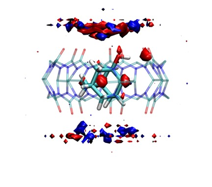

# Heat Capacity $\Delta C_{p,b}$ from GIST analysis

## Total Solvation Energy Grid from GIST
This folder contains the scripts to estimate the heat capacity $\Delta C_{p,b}$ from GIST analysis. Briefly, the solvation free energy in GIST is given by

$$\Delta A_{i} = \Delta E_{i} - T\Delta S_{i}$$

The total solvation energy in each voxel is

$$\Delta E_{i} = E_{i}^{sw} + \left(E_{i}^{ww} - \frac{n_{i}}{n_{i,bulk}} E_{i,bulk}^{ww} \right)$$

where 
* $E_{i}^{sw}$ -- solute-water energy in voxel $i$
* $E_{i}^{ww}$ -- water-water energy in voxel $i$
* $n_{i}$ -- average number of water molecules voxel $i$
* $n_{i,bulk}$ -- average number of water molecules in a pure bulk environment in voxel $i$

The water-water contribution is referenced with the bulk in order to make voxels far away from the solutes have zero values. To simplify things, I calculate the reference value by estimating the average energy in each voxel for a water box simulation at two temperatures. The average $\langle E_{bulk}^{ww} \rangle$ for 298.15 K and 328.15 K are 9.562 kcal/mol and 9.173 kcal/mol, respectively. The water densities at these two temperatures are 0.0334 $\unicode{x212B}^{-3}$ and 0.0320 $\unicode{x212B}^{-3}$, respectively (which you will need to specify in the `cpptraj gist` command). The simulation and analysis scripts for neat (i.e., pure) water are available in [04-pure-water-box](04-pure-water-box). To apply the bulk reference values, we need to subtract $\langle E_{bulk}^{ww} \rangle$ from `Eww-unref-norm`, and then convert the **normalized** back to a **density**:

$$E_{i}^{ww}(dens) = E_{i}^{ww}(norm) \times \frac{N_{i,water}^{ww}}{V_{voxel}N_{frames}}$$

where $N_{i,water}^{ww}/(V_{voxel}N_{frames})$ is the solvent number density. To get the total energy for $E_{i}^{sw}$ and $E_{i}^{ww}$ in each voxel we multiply the **density** grid by the volume of the voxel (here $V_{voxel} = 0.5\times 0.5\times 0.5 = 0.125\,\unicode{x212B}^{-3}$). 

$$\begin{align}
E_{i}^{sw}(total) &= E_{i}^{sw}(dens) \times V_{voxel}\\
$$E_{i}^{ww}(total) &= E_{i}^{ww}(dens) \times V_{voxel}\\
$$T\Delta S_{i}^{trans}(total) &= T\Delta S_{i}^{trans}(dens) \times V_{voxel}\\
$$T\Delta S_{i}^{orient}(total) &= T\Delta S_{i}^{orient}(dens) \times V_{voxel}\end{align}$$

## Heat Capacity Grid from GIST
The heat capacity in each voxel $C_{p,i}$ is estimated by taking the difference in energy at two temperatures divided by the difference in temperature:

$$C_{p,i} = \frac{\Delta E_{i}^{total}(T_2)-\Delta E_{i}^{total}(T_1)}{T_2 - T_1}$$

For the paper, I used temperatures of 298.15 K and 328.15 K, respectively. The change in heat capacity upon binding $\Delta C_{p,i}$ is then obtained by subtracting the grid of the free solutes from the identically aligned bound complex

$$\Delta C_{p,i} = C_{p,i}^{complex} - C_{p,i}^{host} - C_{p,i}^{guest}$$

This folder contains three folders corresponding to the simulations and analysis for the three components above. The heat capacity for each system is estimated with the Jupyter Notebook [Heat_Capacity_GIST.ipynb](Heat_Capacity_GIST.ipynb), which uses [gisttools](https://github.com/liedllab/gisttools) to perform the `GRID` operations. 

## Visualizing the Heat Capacity GIST Grid
Finally, the Jupyter Notebook also includes a command to save $\Delta C_{p,i}$ to a `*.dx` file. I have prepared a visualization state file [gist-dCp-visual-state.vmd](gist-dCp-visual-state.vmd), which you can load in VMD to give the image below. 

