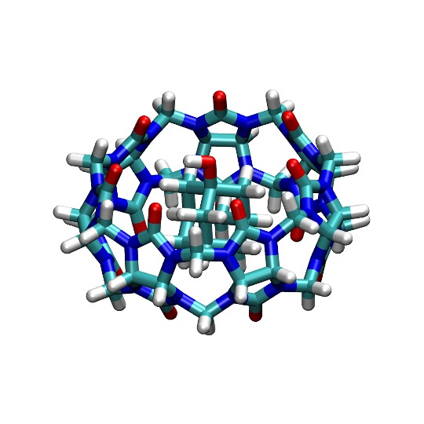

## Assigning Partial Charges with AmberTools
Given a MOL2 file for the host and guest, we can generate a MOL2 with GAFF2 atom types and AM1-BCC charges using AmberTools. Running the commands below may take some time especially for the CB7 host due to the larger number of atoms. 
```bash
antechamber -fi mol2 -fo mol2 -i 1-AdOH.sybyl.mol2 -o 1-AdOH.am1bcc.gaff2.mol2 -at gaff2 -c bcc -nc 0 -rn AMT -pf y

antechamber -fi mol2 -fo mol2 -i cb7.sybyl.mol2 -o cb7.am1bcc.gaff2.mol2 -at gaff2 -c bcc -nc 0 -pl 10 -rn CB7 -pf y 
```

## Generating `frcmod` file
AMBER also require a `frcmod` files for the host and guest molecule for any missing bonded parameters
```bash
parmchk2 -f mol2 -i 1-AdOH.am1bcc.gaff2.mol2 -s gaff2 -o guest.frcmod

parmchk2 -f mol2 -i cb7.am1bcc.gaff2.mol2 -s gaff2 -o host.frcmod
```

## Combining host and guest molecules
I have already prepared the PDB file ([cb7-1-AdOH.pdb](cb7-1-AdOH.pdb)) of the host and guest molecules in the bound state. For new complexes, docking software may need to be used to generate the bound complex.

